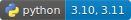

# changepointmodel 
--- 
[](https://github.com/cunybpl/changepointmodel/actions/workflows/pytest.yaml) 


Changepoint modeling, load disaggregation and savings methodologies consistent with ashrae guidelines. 


## About 
---

This is a small toolkit for processing building energy data centered around changepoint modeling. Much of our work is based on industry standard methodologies taken from Ashrae. 

We have found over time that while doing these individual calculations is not difficult, doing them at scale in a well defined way can be. Therefore we tried to design a flexible library that can be used in a variety of contexts such as data science, machine learning and batch processing.


## Features 
----

* Loosely coupled, interface oriented and extensible (`changepoint.core`)
* Wrapper classes for `scipy.optimize.curve_fit` that conform to the `scikit-learn` interface. 
* PEP484 complient (from 3.0.0). Overall strong typing approach. 
* Heavily tested and production ready 


The `core` package consists of the lower level machinery and calculation APIs. The `app` package contains higher level components organized into a ready made application for common building energy modeling tasks and batch processing. 

We have heavily documented each module's public interface. Below is a brief outline of what is inside 

__core__
----
The core APIs are a loosely coupled set of classes that work together to build changepoint models, load aggregations and savings calculations.


* `estimator` - Wrapper classes around `scipy.optimize.curve_fit` with some bells and whistles. 
    * These classes interop with scikit learn and can be incorporated into the sklearn API (`cross_val_score`, `GridSearchCV` etc.) for ML projects.

* `predsum` - Predicted Sum (used for nac calculations)
* `schemas` - Input validation 

_Deprecated from 3.1_

* `loads` - Load calculations for various ParameterModels
* `scoring` - Standard statistical reporting for model validation.
* `factories` - Helper classes for combining Estimators and LoadAggregators

__core.calc__ 
----
Model dependent calculations and ashrae savings formulas. 

* `models` - the standard parameter modeling functions. We use these with `scipy.optimize.curve_fit`'s "trf" algorithm that allows for approximate derivitives and bounded search. 
* `bounds` - a standard set of bounds functions to use. We determine these by analyzing the X value input. 
* `metrics` - scoring metrics borrowed from `sklearn` 
* `loads` - loads calculations for base, heating and cooling 
* `savings` - ashrae savings formulas for monthly data 
* `uncertainties` - ashrae uncertainty calculations for savings 

_Added in 3.1_ 
* tstat - perform a tstat on the slopes of your model for statistical significance 
* dpop - return the heating and cooling points from your model based on slope/changepoint 


__core.pmodels__
_Since 3.1_ 

This was moved into its own package. We consider these private but accessible for anyone wishing to extend the library APIs. 

For most cases you will want to simply use the `factories` provided to create an appropriate changepoint model that can be 
used with our EnergyChangepointEstimator class. These and other useful types are exposed in the top level package.


## Example

_From 3.1_, we went to great lengths to simplfy the use of the core library. 

I will walk through a simple example to show how to estimate a single model and get its load and some statistical scores.

Here is the data we want to model... this could have come in from an API or csv etc. 
```python 

oat = [66.0, 92.0, 98.0, 17.0, 83.0, 57.0, 86.0, 97.0, 96.0, 47.0, 73.0, 32.0]
usage = [834.311, 1992.275, 2304.786, 193.692, 1699.326, 257.449, 1720.430, 2271.0722, 2396.914, 345.639, 1166.869, 225.720]
```


__schemas__ 

Using `CurvefitEstimatorDataModel` will help validate the input data and deliver proper numpy arrays in the correct shape needed to work with `estimator`.

This is a `pydantic` object and will raise a validation error if the types of data are incorrect or if there are length mismatches.

Our current models work with a single dimension y variable for regression and single x variable since for energy modeling it is most common. 

```python 
from changepointmodel import CurverfitEstimatorDataModel 

data = CurvefitEstimatorDataModel(X=oat, y=usage)  # auto validates

data.X # this is an np.array reshaped as a list of lists 
data.y # this should always be a one dimensional array

```

Our primary estimator class is `EnergyChangepointmodelEstimator`. This builds is composed internally of a call to `CurvefitEstimator`. This is an in-house `scikit-learn` wrapper around `scipy.optimize.curve_fit` and follows their developer guidelines. We have tests to show that `CurvefitEstimator` is interoperable with the greater sklearn API and can be used with cross validation and data pipelines if that is something that you are interested in.

For now we just want to fit a three parameter cooling model to get loads and validate scores from the usage. 

__estimator__

```python 
from changepointmodel import pmodels, EnergyChangepointEstimator 

tpc = pmodels.threepc_factory(name='3PC')
estimator = EnergyChangepointmodelEstimator(model=tpc)

X, y, _ = data.sorted_X_y() # get sorted and reshaped copies of original X and y 

estimator.fit(X, y)   # fit your model to the y data 
```

Now that we have a fitted model we can use the model to predict other data or access loads and statistics 

```python 
# maybe these are some normalized oat values... 
X_norms = np.array([49.0, 72.0, 6.0, 63.0, 31.0, 46.0, 57.0, 26.0, 10.0, 72.0, 23.0, 14.0]).reshape(-1,1)

# reshape to NByOne manually here or sklearn wrapper will fail.

estimator.predict(X_norms) # -- returns your predicted y values given a different X  

estimator.coeffs # -- access the fit coeffs as a tuple of floats (scipy's popt return value)
estimator.load() # --returns a Load object -> baseload, heating, cooling

estimator.r2() # -- return the r2 score 
estimator.adjusted_r2() # -- return the adjusted r2 score 
estimator.cvrmse() # -- return the cvrmse 

#... etc. see source for changepointmodel.estimator for full API 

```

__savings__ 

We have a module dedicated for option-c savings calculations. The default implementation uses formulas taken from Ashrae annex. These should only be used when working with monthly data. 

This is sometimes a nuanced process and the API in `savings` is designed to conform to a specific workflow which we at BPL often are required to do at scale. 

The below example shows how you would use `savings` API for adjusted and normalized savings and assumes you found two models for pre and post data that are already fit. 

Note that we provide a scalar value of 30.437 in the example. This is because we often work with usage data that is scaled by avg daily value. The Ashrae formulas need to have this value scaled out in order to work correctly. If you know that your data is not scaled you can leave this defaulted to None which will bypass scaling. 

```python 
... # we fit pre and post estimator objects ... 

from changepointmodel import AshraeAdjustedSavingsCalculator, AshraeNormalizedSavingsCalculator

adj = AshraeAdjustedSavingsCalculator(scalar=30.437)
norm = AshraeNormalizedSavingsCalculator(X_norms=X_norms, scalar=30.437)

adj_result = adj.save(pre, post)  # <- AdjustedSavingsResult
norm_result = norm.save(pre, post)  # <- NormalizedSavingsResult

```

The result objects here contain both calculated energy savings, predicted values and uncertainties. 

In 3.1 we've provided hooks into the acutal calculations in case you know what you're doing and want to supply different calculations. To do this simply subclass `AbstractNormalizedSavingsCalculator` and `AbstractAdjustedSavingsCalculator` and have a blast. 

```python
class MyCustomExperimentalSavingsCalculator(AbstractAdjustedSavingsCalculator):

    def _savings(
        self,
        gross_normalized_pred_y_pre: float,
        gross_normalized_pred_y_post: float,
        pre_cvrmse: float,
        post_cvrmse: float,
        pre_n: int,
        post_n: int,
        pre_p: int,
        post_p: int,
        n_norm: int,
        confidence_interval: float,
    ) -> Tuple[float, float, float, float]:
        ...

        # Your custom calcs shoudl return a 4 float tuple and it work with the rest of our APIs 

```

## Deprecations and Removals

In order to provide a better user experience with this package, some modules have been deprecated and some features out right removed. While we try our best to maintain backwards compatibility unfortunately it is sometimes unavoidable to make the product better. 

The modules listed above are deprecated will still work in 3.1 but might be removed in 3.2 so please don't develop anything new with them. They were left in to make the transition a little easier for us to deal with on our servers. In the case of deprecation we have placed a warning out module scope.

It was decided to completely remove `app` package since it relied mainly on these modules that are being deprecated and really had no use outside of our servers. We hope the `core` API was made more intuitive in 3.1 and can be used to be build applications in a simpler manner. 

Certain class methods on `EnergyChangepointEstimator` were removed (`fit_one`, `fit_many`, etc). These were intended for batch running but proved to be a bit to inflexible for practical use. Methods for sorting data were moved to the `schemas` pydnatic data model as outlined above. 

_NOTE_ Starting with version `3.2` we are moving to pydantic v2 to help validate our input models. This will most certainly break any applications that use this lib as dependency alongside other pydantic based projects. 

## Demos and training

__demos / training__ 

If you're interested in more in depth demos with real world data or need help setting up your own scripts with this package for a project reach out to the dev team! <3


